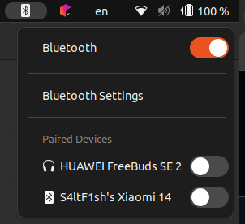

# Quick Bluetooth - GNOME Shell Extension

Are you annoyed by having to go through too many steps to connect to paired devices via bluetooth on ubuntu? Try this

## Features



- ✅ Bluetooth icon on the top bar
- ✅ Quick toggle Bluetooth adapter on/off
- ✅ Display list of paired devices
- ✅ Connect/disconnect devices with one click
- ✅ Show real-time connection status
- ✅ Device type icons (headphones, keyboard, mouse, phone, watch, speaker)
- ✅ **rfkill fallback** when D-Bus fails
- ✅ Quick access to Bluetooth Settings

## System Requirements

- Ubuntu 22.04+ or any distro running GNOME Shell 42+
- BlueZ (pre-installed on Ubuntu)

## Installation (Ubuntu)

### Clone project
```bash
git clone 
cd gnome-quick-bluetooth/scripts
```

### Pre-installation Check (Recommended)

Run quick test to ensure your system is ready:

```bash
./quick-test.sh
```

This script checks:

- BlueZ service
- Bluetooth adapter
- D-Bus permissions
- GNOME Control Center
- rfkill availability

### Insall

```bash
# Run install script
./install.sh

# Restart GNOME Shell
# - On X11: Alt+F2 -> type 'r' -> Enter
# - On Wayland: Log out and log back in

# Enable extension
gnome-extensions enable quick-bluetooth@s4ltf1sh.local
```

## Uninstall

```bash
./uninstall.sh
```

## Troubleshooting

### Extension doesn't appear after installation

1. Ensure GNOME Shell has been restarted
2. Check if extension is enabled:
   ```bash
   gnome-extensions list
   gnome-extensions info quick-bluetooth@s4ltf1sh.local
   ```
3. View error logs:
   ```bash
   journalctl -f -o cat /usr/bin/gnome-shell
   ```

### Cannot toggle Bluetooth on/off

**Common issue**: D-Bus permission or BlueZ not working properly.

**Solutions**:

1. **Run debug script** to check:

   ```bash
   ./debug.sh
   ```
2. **Check BlueZ service**:

   ```bash
   systemctl status bluetooth
   sudo systemctl restart bluetooth
   ```
3. **Test manually with D-Bus**:

   ```bash
   # Find adapter path
   dbus-send --system --print-reply --dest=org.bluez / org.freedesktop.DBus.ObjectManager.GetManagedObjects | grep -o "/org/bluez/hci[0-9]*"

   # Assuming adapter is /org/bluez/hci0
   # Turn off Bluetooth
   dbus-send --system --print-reply --dest=org.bluez /org/bluez/hci0 org.freedesktop.DBus.Properties.Set string:org.bluez.Adapter1 string:Powered variant:boolean:false

   # Turn on
   dbus-send --system --print-reply --dest=org.bluez /org/bluez/hci0 org.freedesktop.DBus.Properties.Set string:org.bluez.Adapter1 string:Powered variant:boolean:true
   ```
4. **Try using rfkill** (if D-Bus doesn't work):

   ```bash
   # Turn off Bluetooth
   rfkill block bluetooth

   # Turn on Bluetooth
   rfkill unblock bluetooth
   ```

### Cannot open Bluetooth Settings

**Common issue**: gnome-control-center not installed or not in PATH.

**Solutions**:

1. **Check if gnome-control-center is installed**:

   ```bash
   which gnome-control-center
   ```
2. **If not installed**:

   ```bash
   sudo apt install gnome-control-center
   ```
3. **Try alternative commands**:

   ```bash
   # Try opening directly
   gnome-control-center bluetooth

   # Or use blueman if available
   blueman-manager

   # Or general settings
   gnome-control-center
   ```
4. **For other desktop environments** (not GNOME):

   - KDE: `systemsettings5 kcm_bluetooth`
   - XFCE: `blueman-manager`
   - Cinnamon: `cinnamon-settings bluetooth`

### Cannot connect/disconnect devices

1. Check BlueZ service is running:
   ```bash
   systemctl status bluetooth
   ```
2. If not running:
   ```bash
   sudo systemctl start bluetooth
   sudo systemctl enable bluetooth
   ```
3. Try connecting manually with bluetoothctl:
   ```bash
   bluetoothctl
   # In bluetoothctl:
   power on
   devices  # View list
   connect XX:XX:XX:XX:XX:XX  # Replace with MAC address
   ```

### Icon doesn't change color when toggling Bluetooth

- Your theme may not support the `bluetooth-disabled-symbolic` icon
- Extension still works normally, this is just a visual issue
- Try changing themes or create custom symbolic icon

### Extension crashes or doesn't display devices

1. **Check log errors**:

   ```bash
   journalctl -f -o cat /usr/bin/gnome-shell | grep -i bluetooth
   ```
2. **Reload extension**:

   ```bash
   gnome-extensions disable quick-bluetooth@s4ltf1sh.local
   gnome-extensions enable quick-bluetooth@s4ltf1sh.local
   ```
3. **Reinstall**:

   ```bash
   rm -rf ~/.local/share/gnome-shell/extensions/quick-bluetooth@s4ltf1sh.local
   ./install.sh
   ```

## Debug Tools

Extension includes a debug script `debug.sh` to check:

- BlueZ service status
- D-Bus connectivity
- Adapter power state
- Available settings commands

Run:

```bash
./debug.sh
```

For checking log:

Run:
```bash
./debug-realtime.sh
```

## Technical Details

This extension uses:

- **D-Bus**: Communicates with BlueZ daemon via D-Bus system bus
- **BlueZ API**: Uses BlueZ interfaces:
  - `org.bluez.Adapter1`: Manages Bluetooth adapter
  - `org.bluez.Device1`: Manages Bluetooth devices
  - `org.freedesktop.DBus.ObjectManager`: Gets object list
- **GNOME Shell APIs**: Integrates with GNOME Shell top bar

## License

MIT License - Feel free to modify and distribute!
